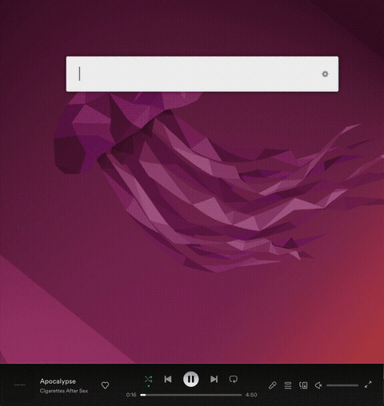
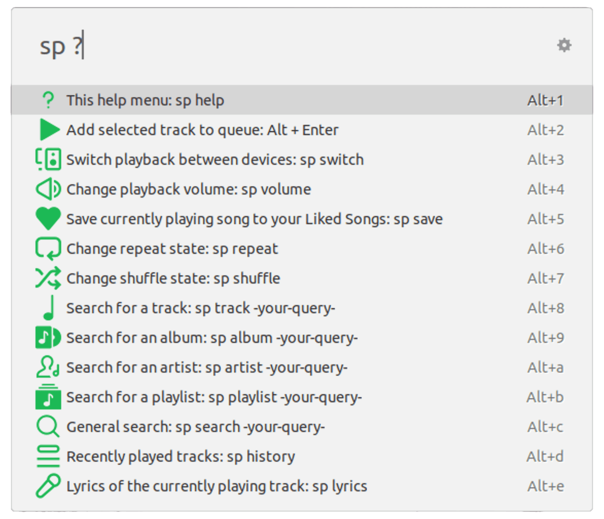

ulauncher-spotify-api
--------------------------
[ulauncher](https://github.com/Ulauncher/Ulauncher) extension that provides Spotify controls through WebAPI.

*Note: some playback features are allowed only for Spotify Premium subscribers (see `Known issues` below).*

Available commands
--------------------------

Motivation
--------------------------
There's a great Ulauncher extension [pywkm/ulauncher-spotify](https://github.com/pywkm/ulauncher-spotify).
However, ulauncher-spotify uses dbus to control Spotify, exposing very limited number of Spotify features to user.

In contrast, this extension makes use of Spotify's [Web API](https://developer.spotify.com/documentation/web-api/)
through which it is possible to use almost all Spotify features. The aim is to provide direct access to most features
that make sense for a command runner.

Installation
--------------------------
Please use the default way to install ulauncher extensions:
`Preferences -> Extensions -> Add extension -> https://github.com/the-lay/ulauncher-spotify-api`.
On the first run, the extension will try to automatically install the dependencies.

For various reasons (hardened permissions, non-standard installations...) automatic installation can fail, 
and the ulauncher will report something along the lines of `ModuleNotFoundError: No module named 'spotipy'`.
In that case, you have to install dependencies manually:
`pip3 install "spotipy>=2.16.1" "requests>=2.23.0"` and then try to reinstall the extension.

In case you have multiple Python environments on your system (PyEnv, Conda etc.),
please note that you have to install the dependencies to the default system python that Ulauncher uses.
Most likely this will be the command you want: `/usr/bin/python3 -m pip install "spotipy>=2.16.1" "requests>=2.23.0"`

Extension's default keyword is `sp`. When you use the extension for the first time, you will have to
go through OAuth authentication and allow access to your Spotify account.
After that,you will be able to use the extension.

*Note: if you ever want to revoke extension's access, you can do so in the
[Apps tab of your Spotify settings](https://www.spotify.com/account/apps/).*

Currently implemented
--------------------------
- Authenticate the user with the Spotify API and automatically refresh access token when expired (`sp` - first run or
when access token is expired)
- Playback functionality: play, pause, next/previous track (`sp` - default menu)
- Show current playback
- Error handling, gracefully handling most of the API errors
- Initiate playback on different devices (if not playing)
- Switch playback between devices (`sp switch`)
- Change repeat state (`sp repeat`)
- Change shuffle state (`sp shuffle`)
- Search for track/album/artist/playlist (`sp album/track/artist/playlist search_query`)
- Search without specifying a type (`sp search search_query`)
- Download images to cache folder and show them in search (and clear cache on extension exit)
- Alt-enter to add track to queue instead of playing now
- PKCE authentication
- Aliases for commands (`sp song` = `sp track`, `sp s` = `sp search`, `sp vol` = `sp volume`)
- Help dialogue (`sp ?` or `sp help`)
- History / recently played songs (`sp history`)
- Spotify volume / mute (`sp volume N`)

Feature roadmap
--------------------------
- Expose different settings in ulauncher preferences (aliases, auth webserver port, request timeout etc.) 
- Podcasts functionality (`sp podcast`)
- Start a radio based on currently playing track (`sp radio`)
- Add an option to make image cache persistent, but with a manual flush cache button

There might be more TODO in [github issues](https://github.com/the-lay/ulauncher-spotify-api/issues/).

If you have any suggestions or feel that something is missing, please
[open a new issue](https://github.com/the-lay/ulauncher-spotify-api/issues/new).

Known issues
--------------------------
- Spotipy's authentication workflow sets up a tiny web server to accept back Spotify's access token.
By default port 8080 is used. If it is taken, authentication will fail.

- Unfortunately, Spotify does not provide API access for free users for the following actions:
  - Next track (Skip User’s Playback To Next Track)
  - Previous track (Skip User’s Playback To Previous Track)
  - Start/resume playback (Start/Resume a User's Playback)
  - Pause playback (Pause a User's Playback)
  - Set repeat mode (Set Repeat Mode On User’s Playback)
  - Switch device (Transfer a User's Playback)
  - Scroll track (Seek To Position In Currently Playing Track)
  - Set volume (Set Volume For User's Playback)
  - Toggle shuffle (Toggle Shuffle For User’s Playback)
  - Add to queue (Add an item to the end of the user's current playback queue)
  
  You will see 403 errors if you try to use those as a free user. 
